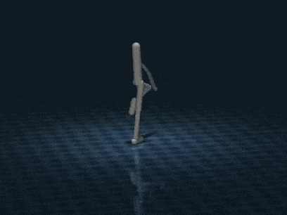
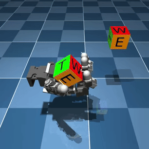
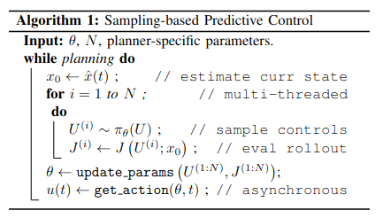

# Hydrax

Sampling-based model predictive control on GPU with
[JAX](https://jax.readthedocs.io/) and
[MuJoCo MJX](https://mujoco.readthedocs.io/en/stable/mjx.html).


&nbsp;&nbsp;&nbsp;


## About

Hydrax implements various sampling-based MPC algorithms on GPU. It is heavily inspired by
[MJPC](https://github.com/google-deepmind/mujoco_mpc), but focuses exclusively
on sampling-based algorithms, runs on hardware accelerators via JAX and MJX, and
includes support for [online domain randomization](#domain-randomization).

Available methods:

| Algorithm | Description | Import |
| --- | ---  | --- |
| [Predictive sampling](https://arxiv.org/abs/2212.00541) | Take the lowest-cost rollout at each iteration. | [`hydrax.algs.PredictiveSampling`](hydrax/algs/predictive_sampling.py) |
| [MPPI](https://arxiv.org/abs/1707.02342) | Take an exponentially weighted average of the rollouts. | [`hydrax.algs.MPPI`](hydrax/algs/mppi.py) |
| [Cross Entropy Method](https://en.wikipedia.org/wiki/Cross-entropy_method) | Fit a Gaussian distribution to the `n` best "elite" rollouts. | [`hydrax.algs.CEM`](hydrax/algs/cem.py) |
| [Evosax](https://github.com/RobertTLange/evosax/) | Any of the 30+ evolution strategies implemented in `evosax`. Includes CMA-ES, differential evolution, and many more. | [`hydrax.algs.Evosax`](hydrax/algs.evosax.py) |

## Setup (conda)

Set up a conda env with cuda support (first time only):

```bash
conda env create -f environment.yml
```

Enter the conda env:

```bash
conda activate hydrax
```

Install the package and dependencies:

```bash
pip install -e . --find-links https://storage.googleapis.com/jax-releases/jax_cuda_releases.html
```

(Optional) set up pre-commit hooks:

```bash
pre-commit autoupdate
pre-commit install
```

(Optional) run unit tests:

```bash
pytest
```

## Examples

Launch an interactive pendulum swingup simulation with predictive sampling:

```bash
python examples/pendulum.py ps
```

Launch an interactive planar walker simulation (shown above) with MPPI:

```bash
python examples/walker mppi
```

Other demos can be found in the `examples` folder.

## Design your own task

Hydrax considers optimal control problems of the form

```math
\begin{align}
\min_{u_t} & \sum_{t=0}^{T} \ell(x_t, u_t) + \phi(x_{T+1}), \\
\mathrm{s.t.}~& x_{t+1} = f(x_t, u_t),
\end{align}
```
where $x_t$ is the system state and $u_t$ is the control input at time $t$, and
the system dynamics $f(x_t, u_t)$ are defined by a mujoco MJX model.

To design a new task, you'll need to specify the cost ($\ell$, $\phi$) and the
dynamics ($f$). You can do this by creating a new class that inherits from
[`hydrax.task_base.Task`](hydrax/task_base.py):

```python
class MyNewTask(Task):
    def __init__(self, ...):
        # Create or load a mujoco model defining the dynamics (f)
        mj_model = ...
        super().__init__(mj_model, ...)

    def running_cost(self, x: mjx.Data, u: jax.Array) -> float:
        # Implement the running cost (l) here
        return ...

    def terminal_cost(self, x: jax.Array) -> float:
        # Implement the terminal cost (phi) here
        return ...
```


The dynamics ($f$) are specified by a `mujoco.MjModel` that is passed to the
constructor. Other constructor arguments specify the planning horizon $T$ and
other details.

For the cost, simply implement the `running_cost` ($\ell$) and
`terminal_cost` ($\phi$) methods.

See [`hydrax.tasks`](hydrax/tasks) for some example task implementations.

## Implement your own control algorithm

Hydrax considers sampling-based MPC algorithms that follow the following
[generic structure](https://arxiv.org/abs/2409.14562):



The meaning of the parameters $\theta$ differ depending on the algorithm. In
predictive sampling, for example, $\theta$ is the mean of a Gaussian distribution
that the controls $U = [u_0, u_1, ...]$ are sampled from.

To implement a new planning algorithm, you'll need to inherit from
[`hydrax.alg_base.SamplingBasedController`](hydrax/alg_base.py) and implement
the four methods shown below:

```python
class MyControlAlgorithm(SamplingBasedController):

    def init_params(self) -> Any:
        # Initialize the policy parameters (theta).
        ...
        return params

    def sample_controls(self, params: Any) -> Tuple[jax.Array, Any]:
        # Sample control sequences U from the policy. Return the samples
        # and the (updated) parameters.
        ...
        return controls, params

    def update_params(self, params: Any, rollouts: Trajectory) -> Any:
        # Update the policy parameters (theta) based on the trajectory data
        # (costs, controls, observations, etc) stored in the rollouts.
        ...
        return new_params

    def get_action(self, params: Any, t: float) -> Any:
        # Return the control action applied t seconds into the trajectory.
        ...
        return u
```

These four methods define a unique sampling-based MPC algorithm. Hydrax takes
care of the rest, including parallelizing rollouts on GPU and collecting the
rollout data in a [`Trajectory`](hydrax/alg_base.py) object.

**Note**: because of
[the way JAX handles randomness](https://jax.readthedocs.io/en/latest/random-numbers.html),
we assume the PRNG key is stored as one of parameters $\theta$. This is why
`sample_controls` returns updated parameters along with the control samples
$U^{(1:N)}$.

For some examples, take a look at [`hydrax.algs`](hydrax/algs).

## Domain Randomization

One benefit of GPU-based simulation is the ability to roll out trajectories with
different model parameters in parallel. Such domain randomization can improve
robustness and help reduce the sim-to-real gap.

Hydrax provides tools to make online domain randomization easy. In particular,
you can add domain randomization to any task by overriding the
`domain_randomize_model` and `domain_randomize_data` methods of a given
[`Task`](hydrax/task_base.py). For example:

```python
class MyDomainRandomizedTask(Task):
    ...

    def domain_randomize_model(self, rng: jax.Array) -> Dict[str, jax.Array]:
        """Randomize the friction coefficients."""
        n_geoms = self.model.geom_friction.shape[0]
        multiplier = jax.random.uniform(rng, (n_geoms,), minval=0.5, maxval=2.0)
        new_frictions = self.model.geom_friction.at[:, 0].set(
            self.model.geom_friction[:, 0] * multiplier
        )
        return {"geom_friction": new_frictions}

    def domain_randomize_data(self, data: mjx.Data, rng: jax.Array) -> Dict[str, jax.Array]:
        """Randomly shift the measured configurations."""
        shift = 0.005 * jax.random.normal(rng, (self.model.nq,))
        return {"qpos": data.qpos + shift}
```
These methods return a dictionary of randomized parameters, given a particular
random seed (`rng`). Hydrax takes care of the details of applying these
parameters to the model and data, and performing rollouts in parallel.

To use a domain randomized task, you'll need to tell the planner how many random
models to use with the `num_randomizations` flag. For example,
```python
task = MyDomainRandomizedTask(...)
ctrl = PredictiveSampling(
    task,
    num_samples=32,
    noise_level=0.1,
    num_randomizations=16,
)
```
sets up a predictive sampling controller that rolls out 32 control sequences
across 16 domain randomized models.

The resulting [`Trajectory`](hydrax/alg_base.py) rollouts will have
dimensions `(num_randomizations, num_samples, num_time_steps, ...)`.

## Risk Strategies

With domain randomization, we need to somehow aggregate costs across the
different domains. By default, we take the average cost over the randomizations,
similar to domain randomization in reinforcement learning. Other strategies are
available via the [`RiskStrategy`](hydrax/risk.py) interface.

For example, to plan using the worst-case maximum cost across randomizations:

```python
from hydrax.risk import WorstCase

...

task = MyDomainRandomizedTask(...)
ctrl = PredictiveSampling(
    task,
    num_samples=32,
    noise_level=0.1,
    num_randomizations=16,
    risk_strategy=WorstCase(),
)
```

Available risk strategies:

| Strategy | Description | Import |
| --- | --- | --- |
| Average (default) | Take the expected cost across randomizations. | [`hydrax.risk.AverageCost`](hydrax/risk.py) |
| Worst-case | Take the maximum cost across randomizations. | [`hydrax.risk.WorstCase`](hydrax/risk.py) |
| Best-case | Take the minimum cost across randomizations. | [`hydrax.risk.BestCase`](hydrax/risk.py) |
| Exponential | Take an exponentially weighted average with parameter $\gamma$. This strategy could be risk-averse ($\gamma > 0$) or risk-seeking ($\gamma < 0$).  | [`hydrax.risk.ExponentialWeightedAverage`](hydrax/risk.py) |
| VaR | Use the [Value at Risk (VaR)](https://en.wikipedia.org/wiki/Value_at_risk). | [`hydrax.risk.ValueAtRisk`](hydrax/risk.py) |
| CVaR | Use the [Conditional Value at Risk (CVaR)](https://en.wikipedia.org/wiki/Expected_shortfall). | [`hydrax.risk.ConditionalValueAtRisk`](hydrax/risk.py) |
